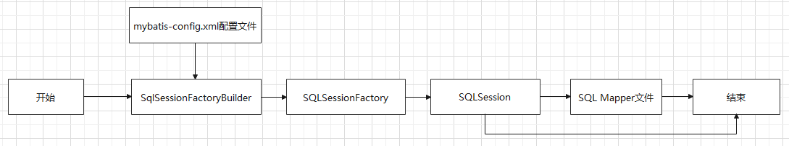
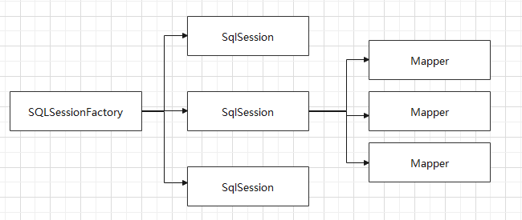

# Mybatis


知识前提：

- JDBC
- MySQL
- Java基础
- Maven
- Junit

官网：[https://mybatis.org/mybatis-3/zh/getting-started.html](https://mybatis.org/mybatis-3/zh/getting-started.html)

## 1. 简介

### 1.1 什么MyBatis

- MyBatis 是一款优秀的**持久层框架**
- 它支持自定义 SQL、存储过程以及高级映射
- MyBatis 免除了几乎所有的 JDBC 代码以及设置参数和获取结果集的工作
- MyBatis 可以通过简单的 XML 或注解来配置和映射原始类型、接口和 Java POJO（Plain Old Java Objects，普通老式 Java 对象）为数据库中的记录。
- MyBatis本是apache的一个[开源项目](https://baike.baidu.com/item/开源项目/3406069)iBatis，2010年这个[项目](https://baike.baidu.com/item/项目/477803)由apache software foundation迁移到了[google code](https://baike.baidu.com/item/google code/2346604)，并且改名为MyBatis。2013年11月迁移到[Github](https://baike.baidu.com/item/Github/10145341)。


如何获得Mybatis？

- maven仓库

  ```xml
  <dependency>
    <groupId>org.mybatis</groupId>
    <artifactId>mybatis</artifactId>
    <version>x.x.x</version>
  </dependency>
  ```

- Github：https://github.com/mybatis/mybatis-3

## 2. 第一个Mybatis程序

思路：搭建环境 -> 导入Mybatis -> 编写代码 -> 测试

### 2.1 搭建数据库

```sql
CREATE DATABASE `mybatis`;

USE `mybatis`;

DROP TABLE IF EXISTS `user`;
CREATE TABLE `user` (
`id` int(20) NOT NULL,
`name` varchar(30) DEFAULT NULL,
`pwd` varchar(30) DEFAULT NULL,
PRIMARY KEY (`id`)
) ENGINE=InnoDB DEFAULT CHARSET=utf8;

insert  into `user`(`id`,`name`,`pwd`) values 
(1,'狂神','123456'),
(2,'张三','abcdef'),
(3,'李四','987654');
```

### 2.2 新建Maven项目

> 1、导入依赖

```xml
<dependency>
   <!-- mybatis -->
   <groupId>org.mybatis</groupId>
   <artifactId>mybatis</artifactId>
   <version>3.5.2</version>
</dependency>
<dependency>
    <!-- mysql驱动 -->
   <groupId>mysql</groupId>
   <artifactId>mysql-connector-java</artifactId>
   <version>5.1.47</version>
</dependency>
```


> 2、编写Mybatis的核心配置文件

```xml
<?xml version="1.0" encoding="UTF-8" ?>
<!DOCTYPE configuration
  PUBLIC "-//mybatis.org//DTD Config 3.0//EN"
  "http://mybatis.org/dtd/mybatis-3-config.dtd">

<!--核心配置文件-->
<configuration>
  <environments default="development">
    <environment id="development">
      <transactionManager type="JDBC"/>
      <dataSource type="POOLED">
        <property name="driver" value="com.mysql.jdbc.Driver"/>
        <property name="url" value="jdbc:mysql://localhost:3306/mybatis?useSSL=true&amp;useUnicode=true&amp;characterEncoding=utf8"/>
        <property name="username" value="root"/>
        <property name="password" value="123456"/>
      </dataSource>
    </environment>
  </environments>
   
  <!-- 每一个Mapper.xml 文件都需要在Mybatis核心配置文件中注册！ -->
  <!-- 不然会报错：org.apache.ibatis.binding.BindingException: Type interface com.kuang.dao.UserDao is not known to the MapperRegistry.-->
  <mappers>
    <mapper resource="com/kuang/dao/UserMapper.xml"/>
  </mappers>
</configuration>
```


> 3、编写工具类

每个基于 MyBatis 的应用都是以一个 SqlSessionFactory 的实例为核心的。SqlSessionFactory 的实例可以通过 SqlSessionFactoryBuilder 获得。而 SqlSessionFactoryBuilder 则可以从 XML 配置文件或一个预先配置的 Configuration 实例来构建出 SqlSessionFactory 实例。

从 XML 文件中构建 SqlSessionFactory 的实例非常简单，建议使用类路径下的资源文件进行配置。 但也可以使用任意的输入流（InputStream）实例，比如用文件路径字符串或 `file://` URL 构造的输入流。MyBatis 包含一个名叫 Resources 的工具类，它包含一些实用方法，使得从类路径或其它位置加载资源文件更加容易。

```java
String resource = "org/mybatis/example/mybatis-config.xml";
InputStream inputStream = Resources.getResourceAsStream(resource);
SqlSessionFactory sqlSessionFactory = new SqlSessionFactoryBuilder().build(inputStream);
```

既然有了 SqlSessionFactory，顾名思义，我们可以从中获得 SqlSession 的实例。SqlSession 提供了在数据库执行 SQL 命令所需的所有方法。你可以通过 SqlSession 实例来直接执行已映射的 SQL 语句。例如：

```java
try (SqlSession session = sqlSessionFactory.openSession()) {
  BlogMapper mapper = session.getMapper(BlogMapper.class);
  Blog blog = mapper.selectBlog(101);
}
```

工具类：

```java
import org.apache.ibatis.io.Resources;
import org.apache.ibatis.session.SqlSession;
import org.apache.ibatis.session.SqlSessionFactory;
import org.apache.ibatis.session.SqlSessionFactoryBuilder;
import java.io.IOException;
import java.io.InputStream;

public class MybatisUtils {

   private static SqlSessionFactory sqlSessionFactory;

   static {
       try {
           String resource = "mybatis-config.xml";
           InputStream inputStream = Resources.getResourceAsStream(resource);
           sqlSessionFactory = new SqlSessionFactoryBuilder().build(inputStream);
      } catch (IOException e) {
           e.printStackTrace();
      }
  }

   //获取SqlSession连接
   public static SqlSession getSession(){
       return sqlSessionFactory.openSession();
  }

}
```


### 2.3 编写代码

> 1、User类

```Java
public class User {
   
   private int id;  //id
   private String name;   //姓名
   private String pwd;   //密码
   
   //构造,有参,无参
   //set/get
   //toString()
   
}
```


> 2、Mapper接口类

```java
import com.kuang.pojo.User;
import java.util.List;

public interface UserMapper {
   List<User> selectUser();
}
```


> 3、编写Mapper.xml配置文件（由原来的UserDaoImpl转变为一个Mapper配置文件）
>
> namespace中的包名一定要和 Dao/Mapper 接口的包名一致！！！

```xml
<?xml version="1.0" encoding="UTF-8" ?>
<!DOCTYPE mapper
       PUBLIC "-//mybatis.org//DTD Mapper 3.0//EN"
       "http://mybatis.org/dtd/mybatis-3-mapper.dtd">

<!--namespace 绑定一个指定的Dao/Mapper接口-->
<mapper namespace="com.kuang.dao.UserMapper">
  <!-- id为Mapper接口里的方法名  resultType是返回类型 -->
  <select id="selectUser" resultType="com.kuang.pojo.User">
    select * from user
  </select>
</mapper>
```


### 2.4 测试

Junit测试：

```java
public class MyTest {
   @Test
   public void selectUser() {
       // 1.获取SqlSession对象
       SqlSession session = MybatisUtils.getSession();
       
       // 2.执行SQL
       // 方式一：getMapper
       UserMapper mapper = session.getMapper(UserMapper.class);
       List<User> users = mapper.selectUser();
       
       // 方式二：不推荐
       // List<User> users = session.selectList("com.kuang.mapper.UserMapper.selectUser");

       for (User user: users){
           System.out.println(user);
       }
       
       // 3. 关闭sqlSession
       session.close();
  }
}
```


> 可能出现问题说明：Maven静态资源过滤问题

maven由于他的约定大于配置，我们之后可能遇到我们写的配置文件，无法被导出或者生效的问题，解决方案：

```xml
<!-- 
  build中配置resources，防止我们资源导出失败的问题 
  约定xml文件是放在resources文件夹下的，如果放在其他地方，可能会有导出失败的问题
-->
<build>
    <resources>
        <resource>
            <directory>src/main/java</directory>
            <includes>
           		<include>**/*.properties</include>
           		<include>**/*.xml</include>
       		</includes>
            <filtering>false</filtering>
        </resource>
        <resource>
       		<directory>src/main/resources</directory>
       		<includes>
           		<include>**/*.properties</include>
           		<include>**/*.xml</include>
       		</includes>
       		<filtering>false</filtering>
   		</resource>
    </resources>
</build>
```


## 3. CRUD

### 3.1 Select

`select` 标签：

- `id`：对应的 namespace 中的方法名
- `resultType`：sql语句执行的返回值类型
- `parameterType`：方法的参数类型


**需求：根据id查询用户**

> 1、编写接口

在UserMapper中添加对应方法

```java
public interface UserMapper {
   //查询全部用户
   List<User> selectUser();
   //根据id查询用户
   User selectUserById(int id);
}
```

> 2、在UserMapper.xml中添加Select语句

```xml
<select id="selectUserById" resultType="com.kuang.pojo.User">
  select * from user where id = #{id}
</select>
```

> 3、测试类中测试

```java
@Test
public void tsetSelectUserById() {
    
    SqlSession session = MybatisUtils.getSession();
    
    UserMapper mapper = session.getMapper(UserMapper.class);
    
    User user = mapper.selectUserById(1);
    System.out.println(user);
    
    session.close();
}
```


### 3.2 Insert

**需求：给数据库增加一个用户**

> 1、在UserMapper接口中添加对应的方法

```java
//添加一个用户
int addUser(User user);
```

> 2、在UserMapper.xml中添加insert语句

```xml
<!-- 对象里的属性，可以直接取出来-->
<insert id="addUser" parameterType="com.kuang.pojo.User">
    insert into user (id,name,pwd) values (#{id},#{name},#{pwd})
</insert>
```

> 3、测试

```java
@Test
public void testAddUser() {
    
    SqlSession session = MybatisUtils.getSession();
   
    UserMapper mapper = session.getMapper(UserMapper.class);
    
    User user = new User(5,"王五","12345");
    int i = mapper.addUser(user);
    System.out.println(i);
    
    //提交事务,重点!不写的话不会提交到数据库
    session.commit(); 
    
    session.close();
}
```

==**注意点：增、删、改操作需要提交事务！否则不会生效！**==

### 3.3 update

**需求：修改用户的信息**

> 1、编写接口方法

```java
//修改一个用户
int updateUser(User user);
```

> 2、编写对应的配置文件SQL

```xml
<update id="updateUser" parameterType="com.kuang.pojo.User">
  update user set name=#{name},pwd=#{pwd} where id = #{id}
</update>
```

> 3、测试

```java
@Test
public void testUpdateUser() {
    SqlSession session = MybatisUtils.getSession();
    
    UserMapper mapper = session.getMapper(UserMapper.class);
    
    User user = mapper.selectUserById(1);
    user.setPwd("asdfgh");
    int i = mapper.updateUser(user);
    System.out.println(i);
    
    //提交事务,重点!不写的话不会提交到数据库
    session.commit(); 
    
    session.close();
}
```

### 3.4 Delete

**需求：根据id删除一个用户**

> 1、编写接口方法

```java
// 根据id删除用户
int deleteUser(int id);
```

> 2、编写对应的配置文件SQL

```xml
<delete id="deleteUser" parameterType="int">
  delete from user where id = #{id}
</delete>
```

> 3、测试

```java
@Test
public void testDeleteUser() {
    SqlSession session = MybatisUtils.getSession();
    
    UserMapper mapper = session.getMapper(UserMapper.class);
    
    int i = mapper.deleteUser(5);
    System.out.println(i);
    
    //提交事务,重点!不写的话不会提交到数据库
    session.commit(); 
    
    session.close();
}
```


### 3.5 小结

易出错点：

- 这里的`resource`需要绑定的是路径，要用`/`

  ```xml
  <mappers>
      <mapper resource="com/kuang/dao/UserMapper.xml"/>
  </mappers>
  ```

- 这里的`namespace`需要用到的是`.`

  ```xml
  <mapper namespace="com.kuang.dao.UserMapper">
      <select id="selectUser" resultType="com.kuang.pojo.User">
          select * from user
    	</select>
  </mapper>
  ```

- 假设实体类或者数据库中的表，字段或者参数过多，我们应当考虑使用Map！

  ```java
  // 接口里写一个增加用户的方法
  int addUser2(Map<String, Object> map);
  ```

  ```xml
  <!--xml文件-->
  <insert id="addUser2" parameterType="map">
      insert into user (id,name,pwd) values (#{userId},#{userName},#{userPwd})
  </insert>
  ```

  ```java
  // 测试
  @Test
  public void testAddUser2() {  
      SqlSession session = MybatisUtils.getSession(); 
      UserMapper mapper = session.getMapper(UserMapper.class);
     
      Map<String, Object> map = new HashMap<String, Object>();
      map.put("userId", 5);
      map.put("userName", "李四");
      map.put("userPwd", "34135");
  
      mapper.addUser2(map);
      
      session.commit(); 
      session.close();
  }
  ```

- Map传递参数，直接在sql中取出key即可！

- 对象传递参数，直接在sql中取对象的属性即可！

- 只有一个基本类型参数的情况下，可以直接在sql中取到！


## 4. 配置解析

### 4.1 核心配置文件

MyBatis 的配置文件`mybatis-config.xml`（可自定义名字）包含了会深深影响 MyBatis 行为的设置和属性信息。 

```xml
<?xml version="1.0" encoding="UTF-8" ?>
<!DOCTYPE configuration
  PUBLIC "-//mybatis.org//DTD Config 3.0//EN"
  "http://mybatis.org/dtd/mybatis-3-config.dtd">
<configuration>
  <environments default="development">
    <environment id="development">
      <transactionManager type="JDBC"/>
      <dataSource type="POOLED">
        <property name="driver" value="${driver}"/>
        <property name="url" value="${url}"/>
        <property name="username" value="${username}"/>
        <property name="password" value="${password}"/>
      </dataSource>
    </environment>
  </environments>
  <mappers>
    <mapper resource="org/mybatis/example/BlogMapper.xml"/>
  </mappers>
</configuration>
```


配置文档的顶层结构如下：（注意元素节点的顺序！顺序不对会报错）

- configuration（配置）
  - properties（属性）
  - settings（设置）
  - typeAliases（类型别名）
  - typeHandlers（类型处理器）
  - objectFactory（对象工厂）
  - plugins（插件）
  - environments（环境配置）
    - environment（环境变量）
      - transactionManager（事务管理器）
      - dataSource（数据源）
  - databaseIdProvider（数据库厂商标识）
  - mappers（映射器）


#### 属性 properties

数据库这些属性可以在外部进行配置，并可以进行动态替换。你既可以在典型的 Java 属性文件中配置这些属性，也可以在 properties 元素的子元素中设置。举例如下：

> 第一步：在资源目录下新建一个db.properties文件

```xml
driver=com.mysql.jdbc.Driver
url=jdbc:mysql://localhost:3306/mybatis?useSSL=true&useUnicode=true&characterEncoding=utf8
username=root
password=123456
```

> 第二步：将外部配置文件（db.properties）导入核心配置文件（mybatis-config.xml）

```xml
<configuration>

    <!--导入properties文件-->
    <properties resource="db.properties"/>

    <environments default="development">
        <environment id="development">
            <transactionManager type="JDBC"/>
            <dataSource type="POOLED">
                <property name="driver" value="${driver}"/>  <!--${}动态替换-->
                <property name="url" value="${url}"/>
                <property name="username" value="${username}"/>
                <property name="password" value="${password}"/>
            </dataSource>
        </environment>
    </environments>
    <mappers>
        <mapper resource="mapper/UserMapper.xml"/>
    </mappers>
</configuration>
```

> 如果一个属性在不只一个地方进行了配置，那么，MyBatis 将按照下面的顺序来加载：
>
> - 首先读取在 properties 元素体内指定的属性。
> - 然后根据 properties 元素中的 resource 属性读取类路径下属性文件，或根据 url 属性指定的路径读取属性文件，并覆盖之前读取过的同名属性。
> - 最后读取作为方法参数传递的属性，并覆盖之前读取过的同名属性。
>
> 因此，**通过方法参数传递的属性具有最高优先级，resource/url 属性中指定的配置文件次之，最低优先级的则是 properties 元素中指定的属性。**


#### 设置 settings

这是 MyBatis 中极为重要的调整设置，它们会改变 MyBatis 的运行时行为。 下表描述了设置中各项设置的含义、默认值等。（只列举常用的，其余的可在官网上看）

| 设置名       | 描述                                                     | 有效值        | 默认值 |
| :----------- | :------------------------------------------------------- | :------------ | :----- |
| cacheEnabled | 全局性地开启或关闭所有映射器配置文件中已配置的任何缓存。 | true \| false | true   |
| lazyLoadingEnabled | 延迟加载的全局开关。当开启时，所有关联对象都会延迟加载。 特定关联关系中可通过设置 `fetchType` 属性来覆盖该项的开关状态。 | true \| false | false |
| useGeneratedKeys   | 允许 JDBC 支持自动生成主键，需要数据库驱动支持。如果设置为 true，将强制使用自动生成主键。尽管一些数据库驱动不支持此特性，但仍可正常工作（如 Derby）。 | true \| false | False |
| mapUnderscoreToCamelCase | 是否开启驼峰命名自动映射，即从经典数据库列名 A_COLUMN 映射到经典 Java 属性名 aColumn。 | true \| false                                                | False  |
| logImpl                  | 指定 MyBatis 所用日志的具体实现，未指定时将自动查找。        | SLF4J \| LOG4J(deprecated since 3.5.9) \| LOG4J2 \| JDK_LOGGING \| COMMONS_LOGGING \| STDOUT_LOGGING \| NO_LOGGING<br />（日志实现） | 未设置 |

一个配置完整的 settings 元素的示例如下：

```xml
<settings>
  <setting name="cacheEnabled" value="true"/>
  <setting name="lazyLoadingEnabled" value="true"/>
  <setting name="multipleResultSetsEnabled" value="true"/>
  <setting name="useColumnLabel" value="true"/>
  <setting name="useGeneratedKeys" value="false"/>
  <setting name="autoMappingBehavior" value="PARTIAL"/>
  <setting name="autoMappingUnknownColumnBehavior" value="WARNING"/>
  <setting name="defaultExecutorType" value="SIMPLE"/>
  <setting name="defaultStatementTimeout" value="25"/>
  <setting name="defaultFetchSize" value="100"/>
  <setting name="safeRowBoundsEnabled" value="false"/>
  <setting name="mapUnderscoreToCamelCase" value="false"/>
  <setting name="localCacheScope" value="SESSION"/>
  <setting name="jdbcTypeForNull" value="OTHER"/>
  <setting name="lazyLoadTriggerMethods" value="equals,clone,hashCode,toString"/>
</settings>
```


#### 类型别名 typeAliases

类型别名可为 Java 类型设置一个缩写名字。 它仅用于 XML 配置，意在降低冗余的全限定类名书写。例如：

```xml
<typeAliases>
  <typeAlias alias="Author" type="domain.blog.Author"/>
  <typeAlias alias="Blog" type="domain.blog.Blog"/>
  <typeAlias alias="Comment" type="domain.blog.Comment"/>
  <typeAlias alias="Post" type="domain.blog.Post"/>
  <typeAlias alias="Section" type="domain.blog.Section"/>
  <typeAlias alias="Tag" type="domain.blog.Tag"/>
</typeAliases>
```

当这样配置时，`Blog` 可以用在任何使用 `domain.blog.Blog` 的地方。

也可以指定一个包名，MyBatis 会在包名下面搜索需要的 Java Bean，比如：

```xml
<typeAliases>
  <package name="domain.blog"/>
</typeAliases>
```

每一个在包 `domain.blog` 中的 Java Bean，**在没有注解的情况下，会使用 Bean 的首字母小写的非限定类名来作为它的别名。** 比如 `domain.blog.Author` 的别名为 `author`；若有注解，则别名为其注解值。见下面的例子：

```java
@Alias("author")
public class Author {
    ...
```

下面是一些为常见的 Java 类型内建的类型别名。它们都是不区分大小写的，注意，为了应对原始类型的命名重复，采取了特殊的命名风格。

| 别名       | 映射的类型 |
| :--------- | :--------- |
| _byte      | byte       |
| _long      | long       |
| _short     | short      |
| _int       | int        |
| _integer   | int        |
| _double    | double     |
| _float     | float      |
| _boolean   | boolean    |
| string     | String     |
| byte       | Byte       |
| long       | Long       |
| short      | Short      |
| int        | Integer    |
| integer    | Integer    |
| double     | Double     |
| float      | Float      |
| boolean    | Boolean    |
| date       | Date       |
| decimal    | BigDecimal |
| bigdecimal | BigDecimal |
| object     | Object     |
| map        | Map        |
| hashmap    | HashMap    |
| list       | List       |
| arraylist  | ArrayList  |
| collection | Collection |
| iterator   | Iterator   |

#### 类型处理器 typeHandlers

- 无论是 MyBatis 在预处理语句（PreparedStatement）中设置一个参数时，还是从结果集中取出一个值时， 都会用类型处理器将获取的值以合适的方式转换成 Java 类型。
- 你可以重写类型处理器或创建你自己的类型处理器来处理不支持的或非标准的类型。【了解即可】

#### 对象工厂 objectFactory

- MyBatis 每次创建结果对象的新实例时，它都会使用一个对象工厂（ObjectFactory）实例来完成。
- 默认的对象工厂需要做的仅仅是实例化目标类，要么通过默认构造方法，要么在参数映射存在的时候通过有参构造方法来实例化。
- 如果想覆盖对象工厂的默认行为，则可以通过创建自己的对象工厂来实现。【了解即可】

#### 插件 plugins

- mybatis-generator-core
- mybatis-plus
- 通用mapper

#### 环境配置 environments

```xml
<environments default="development">
    <environment id="development">
        <transactionManager type="JDBC"/>
        <dataSource type="POOLED">
            <property name="driver" value="${driver}"/>
            <property name="url" value="${url}"/>
            <property name="username" value="${username}"/>
            <property name="password" value="${password}"/>
        </dataSource>
    </environment>
</environments>
```


MyBatis 可以配置成适应多种环境，**不过要记住：尽管可以配置多个环境，但每个 SqlSessionFactory 实例只能选择一种环境。每个数据库对应一个 SqlSessionFactory 实例！**

为了指定创建哪种环境，只要将它作为可选的参数传递给 SqlSessionFactoryBuilder 即可。可以接受环境配置的两个方法签名是：

```java
SqlSessionFactory factory = new SqlSessionFactoryBuilder().build(reader, environment);
SqlSessionFactory factory = new SqlSessionFactoryBuilder().build(reader, environment, properties);
```

如果忽略了环境参数，那么将会加载默认环境，如下所示：

```java
SqlSessionFactory factory = new SqlSessionFactoryBuilder().build(reader);
SqlSessionFactory factory = new SqlSessionFactoryBuilder().build(reader, properties);
```

> **事务管理器（transactionManager）**
>
> `<transactionManager type="JDBC"/>`

在 MyBatis 中有两种类型的事务管理器：

- JDBC – 这个配置直接使用了 JDBC 的提交和回滚设施，它依赖从数据源获得的连接来管理事务作用域。

- MANAGED – 这个配置几乎没做什么。它从不提交或回滚一个连接，而是让容器来管理事务的整个生命周期（比如 JEE 应用服务器的上下文）。 默认情况下它会关闭连接。然而一些容器并不希望连接被关闭，因此需要将 closeConnection 属性设置为 false 来阻止默认的关闭行为。例如:

  ```xml
  <transactionManager type="MANAGED">
    <property name="closeConnection" value="false"/>
  </transactionManager>
  ```

**提示** 如果你正在使用 Spring + MyBatis，则没有必要配置事务管理器，因为 Spring 模块会使用自带的管理器来覆盖前面的配置。

> **数据源（dataSource）**
>
> `<dataSource type="POOLED">`

dataSource 元素使用标准的 JDBC 数据源接口来配置 JDBC 连接对象的资源。

有三种内建的数据源类型：

- **UNPOOLED**：这个数据源的实现会每次请求时打开和关闭连接。
- **POOLED**：种数据源的实现利用“池”的概念将 JDBC 连接对象组织起来，避免了创建新的连接实例时所必需的初始化和认证时间。 这种处理方式很流行，能使并发 Web 应用快速响应请求。
- **JNDI** ：这个数据源实现是为了能在如 EJB 或应用服务器这类容器中使用，容器可以集中或在外部配置数据源，然后放置一个 JNDI 上下文的数据源引用。

数据源也有很多第三方的实现，比如dbcp，c3p0，druid等等....

> Mybatis默认的事务管理器就是JDBC，连接池是POOLED

#### 映射器 mappers

既然 MyBatis 的行为已经由上述元素配置完了，我们现在就要来定义 SQL 映射语句了。 但首先，我们需要告诉 MyBatis 到哪里去找到这些语句。 在自动查找资源方面，Java 并没有提供一个很好的解决方案，所以最好的办法是直接告诉 MyBatis 到哪里去找映射文件。 你可以使用相对于类路径的资源引用，或完全限定资源定位符（包括 `file:///` 形式的 URL），或类名和包名等。

**方式一：【推荐使用】**

```xml
<!-- 使用相对于类路径的资源引用 -->
<mappers>
  <mapper resource="org/mybatis/builder/AuthorMapper.xml"/>
  <mapper resource="org/mybatis/builder/BlogMapper.xml"/>
  <mapper resource="org/mybatis/builder/PostMapper.xml"/>
</mappers>
```

**方式二：使用完全限定资源定位符【不推荐】**

```xml
<!-- 使用完全限定资源定位符（URL） -->
<mappers>
  <mapper url="file:///var/mappers/AuthorMapper.xml"/>
  <mapper url="file:///var/mappers/BlogMapper.xml"/>
  <mapper url="file:///var/mappers/PostMapper.xml"/>
</mappers>
```

**方式三：使用class文件绑定注册**

```xml
<!-- 使用映射器接口实现类的完全限定类名 -->
<mappers>
  <mapper class="org.mybatis.builder.AuthorMapper"/>
  <mapper class="org.mybatis.builder.BlogMapper"/>
  <mapper class="org.mybatis.builder.PostMapper"/>
</mappers>
```

注意点：

- 接口和他的Mapper配置文件必须同名！
- 接口和他的Mapper配置文件必须在同一个包下！

**方式三：使用扫描包进行注入绑定**

```xml
<!-- 将包内的映射器接口实现全部注册为映射器 -->
<mappers>
  <package name="org.mybatis.builder"/>
</mappers>
```

注意点：

- 接口和他的Mapper配置文件必须同名！
- 接口和他的Mapper配置文件必须在同一个包下！

这些配置会告诉 MyBatis 去哪里找映射文件，剩下的细节就应该是每个 SQL 映射文件了。

## 5. 作用域和生命周期



作用域和生命周期是至关重要的，因为错误的使用会导致非常严重的**并发问题**。

------

**提示** **对象生命周期和依赖注入框架**

依赖注入框架可以创建线程安全的、基于事务的 SqlSession 和映射器，并将它们直接注入到你的 bean 中，因此可以直接忽略它们的生命周期。 如果对如何通过依赖注入框架使用 MyBatis 感兴趣，可以研究一下 MyBatis-Spring 或 MyBatis-Guice 两个子项目。

------

### 5.1 SqlSessionFactoryBuilder

这个类可以被实例化、使用和丢弃，**一旦创建了 SqlSessionFactory，就不再需要它了。 因此 SqlSessionFactoryBuilder 实例的最佳作用域是方法作用域（也就是局部方法变量）。** 你可以重用 SqlSessionFactoryBuilder 来创建多个 SqlSessionFactory 实例，但最好还是不要一直保留着它，以保证所有的 XML 解析资源可以被释放给更重要的事情。

### 5.2 SqlSessionFactory

**SqlSessionFactory 一旦被创建就应该在应用的运行期间一直存在，没有任何理由丢弃它或重新创建另一个实例。** 使用 SqlSessionFactory 的最佳实践是在应用运行期间不要重复创建多次，多次重建 SqlSessionFactory 被视为一种代码“坏习惯”。**因此 SqlSessionFactory 的最佳作用域是应用作用域。** 有很多方法可以做到，**最简单的就是使用单例模式或者静态单例模式。**

### 5.3 SqlSession

每个线程都应该有它自己的 SqlSession 实例。SqlSession 的实例不是线程安全的，因此 **是不能被共享的，所以它的最佳的作用域是请求或方法作用域。 绝对不能将 SqlSession 实例的引用放在一个类的静态域，甚至一个类的实例变量也不行。 也绝不能将 SqlSession 实例的引用放在任何类型的托管作用域中，** 比如 Servlet 框架中的 HttpSession。 如果你现在正在使用一种 Web 框架，考虑将 SqlSession 放在一个和 HTTP 请求相似的作用域中。 换句话说，**每次收到 HTTP 请求，就可以打开一个 SqlSession，返回一个响应后，就关闭它。** 这个关闭操作很重要，为了确保每次都能执行关闭操作，你应该把这个关闭操作放到 finally 块中。 下面的示例就是一个确保 SqlSession 关闭的标准模式：

```java
try (SqlSession session = sqlSessionFactory.openSession()) {
  // 你的应用逻辑代码
}
```

在所有代码中都遵循这种使用模式，可以保证所有数据库资源都能被正确地关闭。



这里面的每一个Mapper，就代表一个具体的业务！

## 6. ResultMap

### 6.1 问题

1、数据库中的表 `User(id, name, pwd)`

2、Java项目中的实体类 `User(id, name, password)`

3、有一个接口是根据id查询数据库中的用户

```java
//根据id查询用户
User selectUserById(int id);
```

4、mapper映射文件

```xml
<select id="selectUserById" resultType="user">
  select * from user where id = #{id}
</select>
```

5、测试

```java
@Test
public void testSelectUserById() {
   SqlSession session = MybatisUtils.getSession();  //获取SqlSession连接
   UserMapper mapper = session.getMapper(UserMapper.class);
   User user = mapper.selectUserById(1);
   System.out.println(user);
   session.close();
}
```

6、测试结果

- User{id=1, name='狂神', password='null'}
- 查询出来发现 password 为空 . 说明出现了问题！

7、分析：

- `select * from user where id = #{id}` 可以看做 `select id,name,pwd from user where id = #{id}`
- mybatis会根据这些查询的列名(会将列名转化为小写，数据库不区分大小写)，去对应的实体类中查找相应列名的set方法设值，由于找不到setPwd()，所以password返回null ; **【自动映射】**

### 6.2 解决方案

方案一：为列名指定别名，别名和java实体类的属性名一致。

```xml
<select id="selectUserById" resultType="User">
  select id, name, pwd as password from user where id = #{id}
</select>
```

**方案二：使用结果集映射->ResultMap【手动映射，推荐】** 

```xml
<!-- 结果集映射 -->
<resultMap id="UserMap" type="User">
   <!-- id为主键 -->
   <id column="id" property="id"/>
   <!-- column是数据库表的列名 , property是对应实体类的属性名 -->
   <result column="name" property="name"/>
   <result column="pwd" property="password"/>
</resultMap>

<select id="selectUserById" resultMap="UserMap">
  select id , name , pwd from user where id = #{id}
</select>
```


### 6.3 resultMap 结果映射集

> **自动映射**

- `resultMap` 元素是 MyBatis 中最重要最强大的元素。它可以让你从 90% 的 JDBC `ResultSets` 数据提取代码中解放出来。
- ResultMap 的设计思想是，对于简单的语句根本不需要配置显式的结果映射，而对于复杂一点的语句只需要描述它们的关系就行了。

你已经见过简单映射语句的示例了，但并没有显式指定 `resultMap`。比如：

```xml
<select id="selectUserById" resultType="map">
    select id,name,pwd from user where id = #{id}
</select>
```

上述语句只是简单地将数据库所有的列映射到 `HashMap` 的键上，这由 `resultType` 属性指定。虽然在大部分情况下都够用，但是 HashMap 不是一个很好的模型。你的程序更可能会使用 JavaBean 或 POJO（Plain Old Java Objects，普通老式 Java 对象）作为模型。

> **手动映射**

1、返回值类型为resultMap

```xml
<select id="selectUserById" resultMap="UserMap">
    select id,name,pwd from user where id = #{id}
</select>
```

2、编写resultMap，实现手动映射！

```xml
<resultMap id="UserMap" type="User">
   <!-- id和name属性是和数据库中的字段一致的，可以省略不写
   <id column="id" property="id"/>
   <result column="name" property="name"/>
   -->
   <result column="pwd" property="password"/>
</resultMap>
```

如果世界总是这么简单就好了。但是肯定不是的，数据库中，存在一对多，多对一的情况，我们之后会使用到一些高级的结果集映射，association，collection这些，这将在之后讲解，目前需要把这些知识都消化掉才是最重要的！理解结果集映射的这个概念！


## 7. 日志

