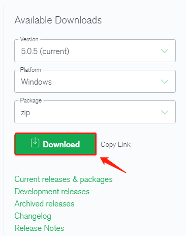
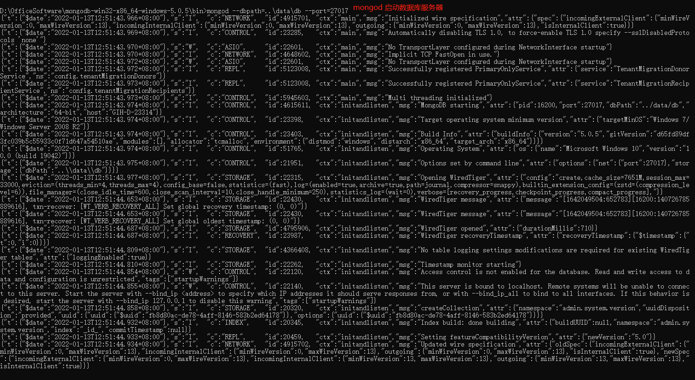

| 数据类型       | 描述                                                         | 举例                                                         |
| -------------- | ------------------------------------------------------------ | ------------------------------------------------------------ |
| 字符串         | UTF-8字符串都可表示为字符串类型的数据                        | {“x” : “foobar”}                                             |
| 对象id         | 对象id是文档的12字节的唯一ID                                 | {“X” :ObjectId() }                                           |
| 布尔值         | 真或者假：true或者false                                      | {“x”:true}                                                   |
| 数组           | 值的集合或者列表可以表示成数组                               | {“x” ： [“a”, “b”, “c”]}                                     |
| 32位整数       | 类型不可用。JavaScript仅支持64位浮点数，所以32位整数会被自动转换。 | shell是不支持该类型的，shell中默认会转换成64位浮点数         |
| 64位整数       | 不支持这个类型。shell会使用一个特殊的内嵌文档来显示64位整数  | shell是不支持该类型的，shell中默认会转换成64位浮点数         |
| 64位浮点数     | shell中的数字就是这一种类型                                  | {“x”：3.14159，”y”：3}                                       |
| null           | 表示空值或者未定义的对象                                     | {“x”:null}                                                   |
| 符号           | shell不支持，shell会将数据库中的符号类型的数据自动转换成字符串 |                                                              |
| 正则表达式     | 文档中可以包含正则表达式，采用JavaScript的正则表达式语法     | {“x” ： /foobar/i}                                           |
| 代码           | 文档中还可以包含JavaScript代码                               | ~~{“x” ： function() { /* …… */ }}~~<br />Deprecated in MongoDB 4.4 |
| 二进制数据     | 二进制数据可以由任意字节的串组成，不过shell中无法使用        |                                                              |
| 最大值/最 小值 | BSON包括一个特殊类型，表示可能的最大值。shell中没有这个类型。 |                                                              |

-----


数据库分类：

- 关系型数据库（RDBMS）
  - 关系型数据库中全都是表
  - MySQL、Oracle、DB2
- 非关系型数据库（NoSQL Not Only SQL）
  - 键值对数据库
  - 文档数据库 MongoDB

# MongoDB

## 1. 简介

MongoDB是一个开源、高性能（C++编写）、基于分布式的文档型数据库，是NoSQL数据库产品中的一种。

MongoDB的数据模型是面向文档的，所谓文档是一种类似JSON的结构。简单理解MongoDB数据库，它存的是各种各样的JSON（BSON）。

三个概念：

- 数据库；
- 集合（collection）：类似于数组，在collection中可以存放document；
- 文档（document）
  - 文档数据库中的最小存储单位，我们存储和操作的内容都是文档；
  - 由字段和值对（`filed:value`）组成，字段的数据类型是`字符型`，它的值除了使用基本的一些类型外，还可以包括`其他文档`、`普通数组`和`文档数组`。当一个文档的属性值是文档时，我们称之为内嵌文档。


> 数据在MongoDB中以 BSON（Binary-JSON）文档的格式存储在磁盘上。BSON（Binary Serialized Document Format）是一种类json的一种二进制形式的存储格式，简称Binary JSON。BSON和JSON一样，支持内嵌的文档对象和数组对象，但是BSON有JSON没有的一些数据类型，如Date和BinData类型。


先来看看SQL和MongoDB术语的对应关系，方便我们对MongoDB有一个大概的了解。

| SQL术语/概念 | MongoDB术语/概念 | 解释/说明                                                    |
| ------------ | ---------------- | ------------------------------------------------------------ |
| database     | database         | 数据库                                                       |
| table        | collection       | 数据库表/集合                                                |
| row          | document         | 数据记录(行)/文档                                            |
| column       | field            | 数据字段/域                                                  |
| index        | index            | 索引                                                         |
| table joins  |                  | 表连接，MongoDB不支持                                        |
|              | 嵌入文档         | MongoDB通过嵌入式文档来替代多表连接<br/>（查询效率要比表连接要高） |
| primary key  | primary key      | 主键，MongoDB自动将_id字段设置为主键                         |

## 1.1 数据模型

## 2. 单机部署（Windows为例）

### 2.1 下载

安装MongoDB，两点注意：

- 根据业界规则，MongoDB的版本命名规范如：x.y.z；
  - y为奇数时表示当前版本为开发版，如：1.5.2、4.1.13；
  - y为偶数时表示当前版本为稳定版，如：1.6.3、4.0.10；
  - z是修正版本号，数字越大越好。
- 32bit的MongoDB最大只能存放2G的数据，64bit就没有限制；
- MongoDB对于32位系统支持不佳，所以3.2版本以后没有再对32位系统的支持。

到 [官网](https://www.mongodb.com/try/download/community) 下载，下载完成后解压zip文件。




### 2.2 准备工作

在启动之前需要先做一些准备：

- 随便找个地方创建文件夹 `data/db` 和文件夹 `data/log`，db文件夹就是默认的数据库存放位置。推荐在MongoDB根目录下创建。
- ~~添加环境变量：在path中添加`D:\OfficeSoftware\mongodb-win32-x86_64-windows-5.0.5\bin`~~（新版不用）


### 2.3 启动服务器

在MongoDB的`bin`目录下打开cmd，输入命令:

```shell
mongod --dbpath=..\data\db --port=27017
```

- `dbpath`指定数据库存放位置，也是刚我们创建的db文件夹所在路径
- `port`指定端口号，默认端口号是27017，端口号尽量4位以上，4位以下的容易跟系统需要用到的端口冲撞 最大不要超过65535。

输入mongod启动 MongoDB服务器成功，也表示我们已经安装MongoDB成功。



---

如若觉得每次输入命令太长太麻烦，可以把参数写到配置文件里，具体做法如下：

1. 在MongoDB的根目录下新建文件夹`config` (config文件夹与bin文件夹同级)

2. 在config文件夹里创建`mongod.conf`文件，文件内容要符合`YAML`语法格式，内容如下：

   ```yaml
   storage:
   #The directory where the mongod instance stores its data.Default Value is "\data\db" on Windows.
     dbPath: D:\OfficeSoftware\mongodb-win32-x86_64-windows-5.0.5\data\db
     
   net:
     #bindIp: 127.0.0.1
     port: 27017
   ```

3. `bin`目录下打开cmd，输入以下命令即可启动服务器

   ```shell
   mongod -f ../config/mongod.conf
   # 或者
   mongod --config ../config/mongod.conf
   ```

   

### 2.4 连接数据库

**启动服务器成功后，记得不要关掉cmd窗口，否则会连着服务器一起关闭掉！！！**

依然是在`bin`目录下，新打开一个cmd窗口：输入

```shell
mongo
```


如上图所示即表示连接成功。

## 3. 指令

### 3.1 基本指令

在MongoDB中，数据库和集合都不需要手动创建。当我们创建文档时，如果文档所在的集合或数据库不存在，mongo服务器会自动创建数据库和集合。

- 显示当前所有数据库：`show dbs` 或者 `show databses`
- 进入到指定数据库中：`use db_name`
- 当前所在的数据库：`db`，db表示的是当前所处的数据库
- 显示所在数据库中的所有集合：`show collections`
- 删除集合：`db.collection_name.drop()`，如果数据库中只有一个集合，那删掉集合的同时会把数据库也删了
- 删除数据库：`db.dropDatabase()`

### 3.2 CRUD

官方文档：https://docs.mongodb.com/manual/crud/

https://docs.mongodb.com/manual/tutorial/getting-started/

查询选择器：https://docs.mongodb.com/manual/reference/operator/query/#std-label-query-selectors

- 增
  - `db.collection_name.insert()`
  - `db.collection.insertOne()` 3.2版本以后才有
  - `db.collection.insertMany()` 3.2版本以后才有
  - 当我们向集合中插入文档时，如果没有给文档指定`_id`属性，则数据库会自动为文档添加`_id`，该属性用来作为文档的唯一标识，是根据时间戳来生成的。
  - `_id` 可以自己指定，但必须要保证它的唯一性。如果我们指定了，数据库就不会给我们添加了。
- 删
  - `db.collection_name.remove()`
    - `remove()` 可以根据条件来删除文档，传递条件的方式和 `find()` 一样
    - `remove()` 必须要有参数，`find()` 可以没有参数
    - `remove({})` 如果只传递一个空对象作为参数，则会删除集合中的所有文档。即清空集合，性能略差
    - 默认情况下会删除符合条件的所有文档，如果`remove()`第二个参数传递一个true，则只会删除一个

  - `db.collection_name.deleteOne()`
  - `db.collection_name.deleteMany()`

- 查 [查询选择器](https://docs.mongodb.com/manual/reference/operator/query/#std-label-query-selectors)
  - `db.collection_name.find()` 效果等价于 `db.collection_name.find({})`，用来查询集合中所有符合条件的文档，返回的是数组
  - `db.collection_name.find({k1:v1, k2:v2, ...})` 查询属性是指定值的文档
  - `db.collection_name.findOne()` 返回符合条件的第一个文档，返回的是一个文档对象
  - `find().count()` 查询符合条件的结果数目
  - `find().limit(10)` 查询前10条数据
  - `find().skip(10).limit(10)` 跳过前10条，查询前11~20这10条数据；skip 和 limit 可以互换位置，效果一样。因为MongoDB会自动调整两者之间的关系。
  - MongoDB支持直接通过内嵌文档的属性进行查询，如果要查询内嵌文档则可以通过`.`的形式来匹配，同时属性名必须要使用引号
    - 比如`db.users.find("hobby.movies":"hero")`
  - 条件 `{k:v}`中的 `:` 并不是 `==` 的意思，而是 `in` 的意思
  - `$set` 是完全替换掉这个属性，类似于重新赋值，`$push` 用于往数组里添加一个新的元素
  - `$addToSet` 往数组里添加一个新的元素，如果数组中已经存在了该元素，则不会添加
- 改
  - `db.collection_name.update(查询条件, 新对象, 默认配置)` 默认会使用新对象来完全替换旧对象
    - 如果需要修改指定的属性，而不是替换，需要使用 修改操作符 来完成修改
    - `update()` 多个符合条件时，默认只会修改一个。可以在第三个参数里修改默认配置。
    - `$set` 可以用来修改文档中的指定属性
    - `$unset` 可以用来删除文档的指定属性
    - `db.collection_name.update({查询条件}, {$set:{k1:v1, ...}}, {默认配置})`
  - `db.collection_name.updateMany()` 同时修改多个符合条件的文档
  - `db.collection_name.updateOne()` 修改一个符合条件的文档
  - `db.collection_name.replaceOne()` 替换一个文档


```shell
# 向numbers中插入2w条数据---速度慢7.2s
for(var i=1; i<=20000; i++){
	db.numbers.insert({num:i});
}

# 速度快的做法 0.4s
var arr = [];
for(var i=1; i<=20000; i++){
	arr.push({num:i});
}
db.numbers.insert(arr);
```

### 3.3 文档之间的关系

可以通过内嵌文档的形式来体现出一下关系：

- 一对一
- 一对多
- 多对多

### 3.4 排序

查询文档时，默认情况是按照 `_id` 的值进行排列（升序）

`sort()` 可以用来指定文档的排列规则，它需要传递一个对象来指定排序规则，1表示升序，-1表示降序

limit、skip、sort可以以任意的顺序进行排序

### 3.5 投影

在查询时，可以在第二个参数的位置来设置查询结果的投影。也就是说，一个文档有多个属性，我们只想要其中的一个或者几个属性，并不想全部获取，这就是投影。

----

# Mongoose

## 1. 简介

Mongoose就是一个让我们可以通过Node来操作MongoDB的模块。它是一个对象文档模型（ODM）库，它对Node原生的MongoDB模块进行了进一步的优化封装，并提供了更多的功能。

好处：

- 可以为文档创建一个模式结构（Schema）
- 可以对模型中的对象/文档进行验证
- 数据可以通过类型转换转换为对象模型
- 可以使用中间件来应用业务逻辑挂钩
- 比Node原生的MongoDB驱动更容易

Mongoose中为我们提供了几个新的对象：

- Schema（模式对象）

  - Schema对象定义约束了数据库中的文档结构

- Model

  - Model对象作为集合中的所有文档的表示，相当于MongoDB数据库中的集合Collection

- Document

  - Document表示集合中的具体文档，相当于集合中的一个具体的文档

  
