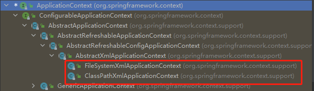

# Spring5

## 1. 框架概述

### 1.1 简介

- Spring 是轻量级的开源的 JavaEE 框架
- Spring 可以解决企业应用开发的复杂性
- Spring 有两个核心部分：IOC 和 Aop
  - IOC：控制反转，把创建对象过程交给 Spring 进行管理
  - Aop：面向切面，不修改源代码进行功能增强
- Spring 特点
  - 方便解耦，简化开发
  - Aop 编程支持
  - 方便程序测试
  - 方便和其他框架进行整合
  - 方便进行事务操作
  - 降低 API 开发难度

### 1.2 入门案例

环境：

- JDK8
- maven3.8.4
- spring5

1、新建maven项目，并导入依赖

```xml
<dependencies>
    <dependency>
        <groupId>org.springframework</groupId>
        <artifactId>spring-beans</artifactId>
        <version>5.2.6.RELEASE</version>
    </dependency>
    <dependency>
        <groupId>org.springframework</groupId>
        <artifactId>spring-core</artifactId>
        <version>5.2.6.RELEASE</version>
    </dependency>
    <dependency>
        <groupId>org.springframework</groupId>
        <artifactId>spring-context</artifactId>
        <version>5.2.6.RELEASE</version>
    </dependency>
    <dependency>
        <groupId>org.springframework</groupId>
        <artifactId>spring-expression</artifactId>
        <version>5.2.6.RELEASE</version>
    </dependency>
    <dependency>
        <groupId>junit</groupId>
        <artifactId>junit</artifactId>
        <version>4.11</version>
        <scope>test</scope>
    </dependency>
</dependencies>
```

2、创建实体类User.java

```java
public class User {
    String name;
    String pwd;
    // get set
}
```

3、在resources下创建application.xml

Spring配置文件使用xml格式

```xml
<?xml version="1.0" encoding="UTF-8"?>
<beans xmlns="http://www.springframework.org/schema/beans"
       xmlns:xsi="http://www.w3.org/2001/XMLSchema-instance"
       xsi:schemaLocation="http://www.springframework.org/schema/beans
        http://www.springframework.org/schema/beans/spring-beans.xsd">
    <!-- 配置 User 对象创建 -->
    <bean id="user" class="com.wdn.bean.User">
        <property name="name" value="小明"/>
        <property name="pwd" value="1234546"/>
    </bean>
</beans>
```

4、测试

```java
import com.wdn.bean.User;
import org.junit.Test;
import org.springframework.context.ApplicationContext;
import org.springframework.context.support.ClassPathXmlApplicationContext;

public class TestSpring5 {
    @Test
    public void testUser(){
        // 1.加载spring配置文件
        ApplicationContext context = new ClassPathXmlApplicationContext("application.xml");
        // 2.获取配置创建的对象
        User user = context.getBean("user", User.class);
        System.out.println(user.getName());
    }
}
```

## 2. IOC

### 2.1 IOC 底层原理

> 1、什么是IOC

（1）控制反转，把创建对象和对象之间的调用过程，交给Spring进行管理

（2）使用IOC目的：为了耦合度降低

（3）入门案例执行过程就是利用了IOC实现

> 2、IOC底层原理

（1）知识：xml解析、工厂模式、反射

（2）画图讲解IOC底层原理

.png)

.png)

### 2.2 IOC 接口（BeanFactory） 

1、IOC思想基于IOC容器完成，IOC容器底层就是对象工厂。

2、Spring提供IOC容器实现两种方式：（两个接口）

（1）BeanFactory：IOC容器基本实现，是Spring的内部使用接口，不推荐开发人员进行使用；

- 懒加载：加载配置文件时不会创建对象，在获取（使用）对象时才去创建对象

（2）ApplicationContext：BeanFactory接口的子接口，提供更多更强大的功能，一般由开发人员进行使用；

- 加载配置文件时，就会把在配置文件中的对象进行创建
- 把耗时耗资源的操作都在项目启动的时候进行处理更合适，比如 web+tomacat 就是优先使用ApplicationContext更适合。

3、ApplicationContext接口所有实现类：



### 2.3 IOC容器-Bean管理

Bean管理主要就是两个操作：

- Spring创建对象；
- Spring注入属性；

#### 基于xml配置文件

> 创建对象

```xml
<!-- User 对象创建 -->
<bean id="user" class="com.wdn.bean.User"></bean>
```

（1）在Spring配置文件中，使用 bean 标签，标签里面添加对应属性，就可以实现对象创建。

（2）在 bean 标签中有很多属性，常用的属性：

- id 属性：唯一标识，不能包含特殊符号
- class 属性：类全路径（包类路径）
- name 属性：可以为Bean指定多个名称，每个名称之间用逗号或分号隔开，名称可以包含特殊符号

（3）==创建对象时候，默认也是执行无参数构造方法完成对象创建==


> 注入属性

**第一种方式：set方法注入属性**

（1）创建类，定义属性和对应的set方法

```java
public class User {
    String name;
    String pwd;

    public void setName(String name) {
        this.name = name;
    }

    public void setPwd(String pwd) {
        this.pwd = pwd;
    }
}
```

（2）使用 property 完成属性注入

- name：类里面属性名称
- value：向属性注入的值

```xml
<bean id="user" class="com.wdn.bean.User">
    <property name="name" value="小明"/>
    <property name="pwd" value="1234546"/>
</bean>
```


**第二种方式：使用有参数构造进行注入**

（1）创建类，定义属性和对应的有参数构造方法

```java
public class User {
    String name;
    String pwd;

    public User(String name, String pwd) {
        this.name = name;
        this.pwd = pwd;
    }
}
```

（2）使用有参数构造注入属性

```xml
<bean id="user1" class="com.wdn.bean.User">
    <constructor-arg name="name" value="小欧"></constructor-arg>
    <constructor-arg name="pwd" value="12435"></constructor-arg>
</bean>
```


**第三种方式：p 名称空间注入（了解）**

使用 p 名称空间注入，本质也是使用 set 方法注入，只是可以简化基于xml配置方式！

（1）添加 p 名称空间在配置文件中（第3行是新添的）

```xml
<?xml version="1.0" encoding="UTF-8"?>
<beans xmlns="http://www.springframework.org/schema/beans"
       xmlns:p="http://www.springframework.org/schema/p"  
       xmlns:xsi="http://www.w3.org/2001/XMLSchema-instance"
       xsi:schemaLocation="http://www.springframework.org/schema/beans
        http://www.springframework.org/schema/beans/spring-beans.xsd">
```

（2）进行属性注入，在 bean 标签里面进行操作（算是set方式注入的简化操作）

```xml
<bean id="user2" class="com.wdn.bean.User" p:name="小吴" p:pwd="13587"></bean>
```


**xml注入其他类型属性**

1、字面量

（1）null值

```xml
<bean id="user3" class="com.wdn.bean.User">
    <property name="name">
        <null/>
    </property>
</bean>
```

效果等价于

```xml
<bean id="user3" class="com.wdn.bean.User"></bean>
```

输出 user3 的 name 属性，都会得到 null

（2）特殊符号

```xml
<!--属性值包含特殊符号
 1、把<>进行转义 &lt;  &gt;
 2、把带特殊符号内容写到 CDATA
-->

<bean id="user4" class="com.wdn.bean.User">
    <property name="pwd">
        <value>
            <![CDATA[此处写入包含特殊符号的值，比如<<>>]]>
        </value>
    </property>
</bean>
```


### 2.4 IOC 操作 Bean 管理（基于注解）

## 3. AOP


## 4. JDBCTemplate


## 5. 事务管理


## 6. Spring5新特性


