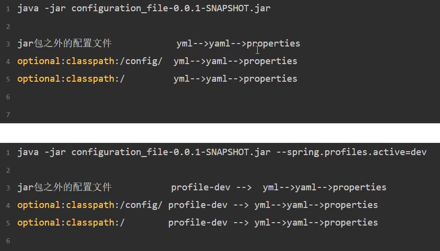

# SpringBoot2

## 1. 简介及快速搭建

### 1.1 简介

SpringBoot基于Spring开发，继承了Spring框架原有的优秀特性。其设计目的是通过提供默认配置等方式，简化Spring应用的初始搭建以及开发过程。

SpingBoot 1.0基于Spring 4.0 开发

SpingBoot 2.0基于Spring 5.0 开发

**约定大于配置**

### 1.2 微服务


### 1.3 快速搭建


## 2. spingboot的配置和自动配置原理

### 2.1 使用Spring Initializer快速创建Spring Boot项目


### 2.2 自定义 SpringApplication

- 懒启动
- 关闭spring boot横幅
- 

### 2.3 配置文件的使用

配置文件有两种后缀：properties、yaml、yml

读取配置文件优先级：yml > yaml > properties

```yaml
<includes>
	<include>**/application*.yml</include>
    <include>**/application*.yaml</include>
    <include>**/application*.properties</include>
</includes>
```

配置文件优先级（从低到高）：

- 编译后的classpath根目录下的（也就是resource目录下的）  （1）
- classpath/config下的（也就是resource/config目录下的） （2）
- 项目根目录下的。如果当前项目是继承/耦合 关系maven项目的话，项目根目录=父maven项目的根目录  （3）
- 项目根目录/config  （4）
- 命令行上指定的配置文件

优先级高的为主，优先级低的补充

```
. project-sample
├── config
│   ├── application.yml （4）
│   └── src/main/resources
|   │   ├── application.yml （1）
|   │   └── config
|   |   │   ├── application.yml （2）
├── application.yml （3）

（）数字越大，优先级越高，加载顺序越靠后，越以它为主
```





#### profile文件的加载

spring官方给出的语法规则是 application-{profile}.yml


简单点例子：

resources目录下有3个配置文件：application、application-dev、application-prod

如果不指定profile：只加载application

如果指定profile为dev：先加载application，后加载application-dev，后者会覆盖前者

### 2.4 自动配置原理


## 3. 热部署与日志


## 4. springboot与web开发


## 5. 集成MyBatis


## 6. 启动原理源码剖析


## 7. 自定义starters


## 8. 集成常用中间件


## 9. 常用注解

@SpringBootApplication：标记成SpringBoot的启动类

```java
// 主程序启动类
// 该类中使用了一个组合注解 @SpringBootApplication，用来开启 Spring Boot 的自动配置
// 另外该启动类中包含一个 main() 方法，用来启动该项目。
@SpringBootApplication
public class HelloWorldApplication {
    public static void main(String[] args) {
        SpringApplication.run(HelloWorldApplication.class, args);
    }
}

// 注意：Spring Boot 内部集成了 Tomcat，不需要人为手动配置 Tomcat，
// 开发者只需要关注具体的业务逻辑即可。
```


@RestController：@Controller + @ ResponseBody

@RequestMapping


